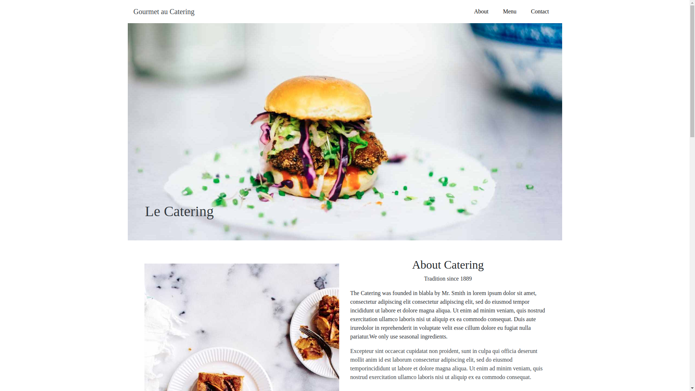

<h1 align="center">
    <a href="https://andrierlison.github.io/gourmet-catering">🔗Gourmet Catering</a>
</h1>

<p align="center">
    <a href="#technologies">Technologies</a> •
    <a href="https://github.com/Andrierlison/gourmet-catering/blob/master/LICENSE">License</a> •
    <a href="#author">Author</a>
</p>

<h2>This is another one of 'my projects' in bootstrap the original project is not mine, I just used the templates from the w3c school templates for inspiration.</h2>

<h3>
    
</h3>

<h3 id="technologies">The following tools were used in the construction of the project:</h3>

- [Html](https://developer.mozilla.org/pt-BR/docs/Web/HTML)
- [Bootstrap](https://getbootstrap.com/)

<h3>Copy</h3>
<p>You can feel free to copy the page</p>

<p>Você vai precisar do <a href="https://git-scm.com">Git</a> instalado na sua maquina</p>
<p>In addition, it is good to have an editor to work with the code as <a href="https://code.visualstudio.com/">VSCode</a></p>

<h3>Clone this repository</h3>

```
$ git clone https://github.com/Andrierlison/gourmet-catering

# Access the project folder in the / cmd terminal

$ cd gourmet-catering
```

<h1 id="author">Author</h1>

<p>Andrierlison da Silva</p>
<a href="https://www.linkedin.com/in/andrierlison-da-silva-916775190/">🔗Linkedin</a>
<a href="https://github.com/Andrierlison">🔗Github</a>
<a href="mailto:andrierlisonsilva8@gmail.com"><i class="fas fa-envelope"></i>🔗andrierlisonsilva8@gmail.com</a>
